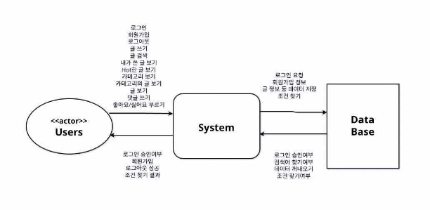

# **Talky 토키**

1\.conceptualization  Document

|Student  No.|22112072|
| - | - |
|Name|박예원|
|E-mail|keroro0101@naver.com|

### [  Revision  history  ]

|**Revision  date**|**Version  #**|**Description**|**Author**|
| - | - | - | - |
|03/2/2023|1\.0|First  Writing||
|||||
|||||
|||||
|||||
|||||

### =  Contents  =

1. Business  purpose  ························································································  1
1. System  context  diagram ·············································································  2
1. Use  case  list ····································································································  3
1. Concept  of  operation ···················································································  5
1. Problem  statement ························································································  8
1. Glossary ············································································································  9
1. Reference ·······································································································  10

## 1. Business  purpose
#### 1) Project  background

[그림  1]  -  혼자  스마트폰을  보고  미소짓는  남자

  현재  우리는  개인주의적인  시대에  살고  있다.  혼밥,  독신,  1인  가구  등  점점  혼자가 편해지는  세상으로  도래하고  있다.  하지만  혼자가  편하다고  해서  외롭지  않은  것은  아니 다.  우리는  사람이기  때문에  누구나  외로움을  탄다.  내  마음을  누군가와  나누고  싶은  순 간이  얼마든지  존재한다.

  혼자  영화를  보고  집에  가면  이  영화의  감상평을  누군가와  나누지  못한다.  이때,  감상 평을  나누고  싶은  마음은  당연하다.  하지만  그러지  못할  때,  우리는  이  앱을  이용할  것 이다.  과제  하다가  막혔을  때,  딱히  물어볼  곳이  없을  때가  있다.  이때,  이  앱을  통해  문 제점을  해결할  수  있다.  공짜  햄버거  쿠폰을  얻을  방법을  알  때,  이를  공유하고  싶을  수 있다.  이  앱을  통해  이런  정보들을  공유하며  정보를  주고받을  수  있다.  우리는  이를  통 해  혼자만의  외로움을  달래고  부족한  점을  채울  수  있다.

  앱에  자신이  느낀  생각,  궁금한  점들을  적어  올린다.  다른  사람들은  이  글을  본  자기 생각을  공유하거나,  공감할  수  있다.  우리들은  댓글들을  보며  뿌듯함,  따듯함  등을  느끼

며  교감한다.  익명이기  때문에  서로가  자신의  본모습으로  대화하며,  솔직한  자신의  심정

을  털어놓는다.  정말  편한  친구가  생기는  것과  같다.  결과적으로  이  애플리케이션이  이 용자들에게  삶의  일부로  자리  잡는다면  좋겠다.

#### 2) Goal
   1. 대부분의  사람이  지닌  스마트폰  애플리케이션으로  서비스  개발
   1. 원하는  사람  누구나  이용  가능
   1. 데이터베이스를  이용한  효율적인  데이터  조정
#### 3) Target  market

  스마트폰을  지닌  모든  사람이  제한  없이  사용할  수  있다.

## 2. System  context  diagram

[그림  2]  System  context  diagram

\-  2  -

- Login  로그인
- Join  회원가입
- Logout  로그아웃
- Writing  글 쓰기
- Search Writings  글 검색
- View my Writings  내가 쓴 글 보기
- View hot Writings  인기있는 글 보기
- View Categories  카테고리 보기
- View Writings in Category  카테고리의 글 보기
- View Writing  글 보기
- Writing Comments  댓글 쓰기
- Press Like / Dislike Button  좋아요 또는 싫어요 버튼 누르기

\-  3  -

## 3. Use  case  list
1) Login

|**Actor**|User|
| - | - |
|**Description**|사용자가 각자 자신의 아이디로 로그인한다.|
2) Join

|**Actor**|User|
| - | - |
|**Description**|사용자가 새로 회원가입 한다.|
3) Logout

|**Actor**|User|
| - | - |
|**Description**|사용자가 로그아웃한다.|
4) Writing

|**Actor**|User|
| - | - |
|**Description**|사용자가 카테고리에 맞는 자신의 글을 쓴다.|
5) Search  Writings

|**Actor**|User|
| - | - |
|**Description**|사용자가 찾고 싶은 글을 검색한다.|
6) View  my  Writings

|**Actor**|User|
| - | - |
|**Description**|사용자가 작성한 모든 글을 본다.|
7) View  hot  Writings

|**Actor**|User|
| - | - |
|**Description**|좋아요를 많이 받은 hot한 글을 본다.|
8) View  Categories

|**Actor**|User|
| - | - |
|**Description**|모든 카테고리를 본다.|
9) View  Writings  in  Category

|**Actor**|User|
| - | - |
|**Description**|카테고리 안에 있는 모든 글을 본다.|
10) View  Writing

|**Actor**|User|
| - | - |
|**Description**|관심있는 글을 본다.|
11) Writing  Comments

|**Actor**|User|
| - | - |
|**Description**|글을 보다가 댓글을 작성한다.|
12) Press  Like  /  Dislike  Button

|**Actor**|User|
| - | - |
|**Description**|글을 보고 좋아요 또는 싫어요 버튼을 누른다.|

## 4. Concept  of  operation
1) Login

|**Purpose**|앱을 사용하기 위해 등록된 사용자인지 확인|
| - | - |
|**Approach**|사용자가 앱을 실행 후 로그인 시, ID, PW를 입력 후 로그인을 요청하면 데이터베이스에 저장된 회원 정보를 조회 후 로그인 성 공/실패 여부 확인한다.|
|**Dynamics**|앱 실행 시 로그인할 경우|
|**Goals**|로그인 기능을 구현한다.|
2) Join

|**Purpose**|앱을 사용하기 위해 신규 사용자 등록|
| - | - |
|**Approach**|사용자가 앱을 실행 후 회원가입 시, ID, PW, 닉네임을 새로 입력 후 요청한다. ID가 중복되지 않는 경우 회원가입에 성공하고 회원 정보를 데이터베이스에 저장한다.|
|**Dynamics**|앱을 사용하기 위해 회원가입을 하는 경우|
|**Goals**|회원가입 기능을 구현한다.|
3) Logout

|**Purpose**|다른 아이디로 로그인하고 싶은 경우 먼저 로그아웃한다|
| - | - |
|**Approach**|사용자가 앱을 사용하는 중 로그아웃을 요청하면 로그인 화면으 로 돌아간다.|
|**Dynamics**|앱 사용 중 로그아웃할 경우|
|**Goals**|로그아웃 기능을 구현한다.|
4) Writing

|**Purpose**|적고 싶은 새로운 글쓰기|
| - | - |
|**Approach**|홈 화면에서 글쓰기 버튼을 누르면 글쓰기 화면으로 넘어간다. 글 의 카테고리를 고르고 제목과 글을 적은 뒤 완료 버튼을 누르면 글이 작성된다.|
|**Dynamics**|새로운 글을 쓰고 싶은 경우|
|**Goals**|원하는 글을 적어 정보를 얻거나 공유할 수 있다.|
5) Search  Writings

|**Purpose**|찾고 싶은 글 검색|
| - | - |
|**Approach**|홈 화면에서 검색 버튼을 누르면 검색 화면으로 넘어간다. 검색어 를 입력하고 완료 버튼을 누르면 일치하는 글을 찾는다. 검색어는 글 제목, 글 내용 등으로 찾을 수 있다. 글은 미리보기 형태로 보 인다. 미리보기 정보에는 카테고리, 글 제목, 작성 날짜가 있다.|
|**Dynamics**|찾고 싶은 글을 검색하는 경우|
|**Goals**|내용을 특정해서 찾는 정보의 글을 볼 수 있다.|
6) View  my  Writings

|**Purpose**|사용자가 쓴 모든 글 보기|
| - | - |
|**Approach**|홈 화면에서 나의 글 버튼을 누르는 경우 나의 글 화면으로 넘어 간다. 사용자가 이전에 작성했던 모든 글을 보여준다. 글은 미리 보기 형태로 보인다.|
|**Dynamics**|사용자가 전에 쓴 모든 글을 보고 싶은 경우|
|**Goals**|사용자가 과거에 적었던 모든 글을 보고 회상할 수 있다.|
7) View  hot  Writings

|**Purpose**|hot 한 글 보기|
| - | - |
|**Approach**|홈 화면에서 Hot 버튼을 누르는 경우 Hot 화면으로 넘어간다. 저 장된 글 중에서 작성한 지 24시간 이내이면서 ‘좋아요‘ 수가 많은 글을 보여준다. 글은 미리보기 형태로 보인다.|
|**Dynamics**|hot 한 글을 보고 싶은 경우|
|**Goals**|작성된 글 중에 인기 있고 재밌는 글을 볼 수 있다.|
8) View  Categories

|**Purpose**|글 카테고리 보기|
| - | - |
|**Approach**|홈 화면에서 버튼들 밑에 카테고리 테이블이 보인다. 스크롤이 가 능해서 모든 카테고리를 볼 수 있다.|
|**Dynamics**|글이 분류된 카테고리를 보고 싶은 경우|
|**Goals**|글을 카테고리별로 분류해서 글을 정리할 수 있다.|
9) View  Writings  in  Category

|**Purpose**|카테고리 내의 글 보기|
| - | - |
|**Approach**|홈  화면의  카테고리  테이블에서  카테고리를  선택하면  카테고리 내의 모든 글을 보여준다. 글들은 미리보기 형태로 보인다.|
|**Dynamics**|카테고리별로 작성된 모든 글을 보는 경우|
|**Goals**|원하는 카테고리에 포함된 모든 글을 볼 수 있다.|
10) View  Writing

|**Purpose**|작성된 글 보기|
| - | - |
|**Approach**|글을 선택하면 작성된 글을 보여준다. 글은 자세하게 보인다. 자 세한 정보에는 카테고리, 제목, 작성일, 좋아요 개수, 싫어요 개수, 댓글 등이 보인다.|
|**Dynamics**|보고 싶은 글을 보는 경우|
|**Goals**|작성된 글을 자세히 볼 수 있다.|
11) Writing  Comments

|**Purpose**|작성된 글에 댓글을 쓴다.|
| - | - |
|**Approach**|글 보기 화면에서 댓글 쓰기 버튼을 누르면 댓글 쓰기 화면으로 넘어간다. 내용을 입력하고 완료 버튼을 누르면 댓글이 작성된다.|
|**Dynamics**|글을 보고 댓글을 쓰고 싶은 경우|
|**Goals**|글을 보고 든 생각을 공유할 수 있다.|
12) Press  Like  /  Dislike  Button

|**Purpose**|작성된 글에 좋아요 또는 싫어요 버튼을 누른다|
| - | - |
|**Approach**|글 보기 화면에서 좋아요 또는 싫어요 버튼을 누르면 개수가 하 나 증가한다.|
|**Dynamics**|글을 보고 공감하고 싶은 경우|
|**Goals**|글을 보고 든 생각을 공유할 수 있다.|

## 5. Problem  statement

#### **Overview**

  “Talky”는  사용자들이  자신의  이야기를  하고,  남의  이야기를  들으며  소통하는  것을  도 와주는  서비스이다.  이를  효울적으로  이루기  위해서는  다음과  같은  목적을  달성해야  한 다.

- 깔끔  명료한  디자인
- 여러  정보들을  저장하는  데이터베이스
- 서버가  없기  때문에  등록은  따로  이뤄져야  한다.
- 원하는  글을  검색할  정확성

##### **Problem  #1  Java  GUI**

  자바  GUI  프로그래밍은  직접  개발한  경험이  없다.  따라서  원하는  앱  디자인을  만들지 못할수도  있다.  때문에  원하는  디자인을  구현할  수  있도록  자바  GUI  공부를  열심히  해 야한다.

##### **Problem  #2  Database**

  데이터베이스를  이용해서  프로그래밍을  개발한  경험이  없다.  앱에  작성된  정보를  효율 적으로  관리하기  위해  데이터베이스  응용법을  터득해야  한다.  댓글의  개수는  계속  증가 하기  때문에,  이를  효율적으로  저장할  방법을  배워야한다.

#### **Problem  #3  No  Real-time  System**

  서버가  없기  때문에  글이나,  댓글  작성  시  실시간성이  떨어진다.  때문에  정보  등록시 새로고침  기능을  개발자가  직접  추가해야  한다.

#### **Problem  #4  Search  Accuracy**

  검색어로  글을  찾을  때  제목만으로  찾으면  원하는  글을  찾을  가능성이  떨어진다.  검색 시간이  더욱  소요되겠지만  글  내용으로도  글을  찾을  수  있어야  한다.

## 6. Glossary

|**Term**|**Description**|
| - | - |
|**사용자**|앱을 사용하는 일반 사용자|
|**데이터베이스**|회원정보, 글, 댓글 등이 데이터로 저장되는 곳|
|**닉네임**|사용자 별명|
|**로그인 화면**|앱에서 로그인, 회원가입을 할 수 있는 화면|
|**홈 화면**|앱에서 로그인하면 실행되는 화면, 즉 기본 화면|
|**글 / Writing**|사용자들이 작성한 게시글|
|**카테고리**|글을 주제별로 나누어 놓은 것|
|**미리보기**|글의 간략한 정보(카테고리, 제목, 작성일) 등이 보여지는 것|
|**테이블**|해당하는 모든 정보를 보여주는 표|
|**좋아요 / 싫어요**|글에서 누르는 좋아요, 싫어요 공감. SNS의 좋아요, 싫어요 기 능과 유사|
|**Hot**|인기 있는, 떠오르는|

## 7. References

[그림  1] https://jhealthmedia.joins.com/article/article\_view.asp?pno=25382
\-  9  -
