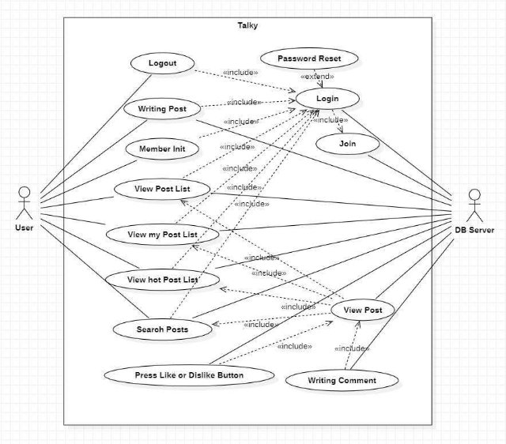
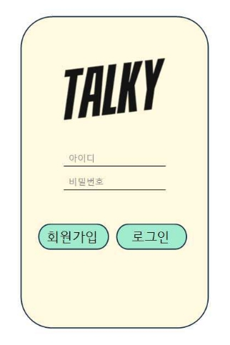
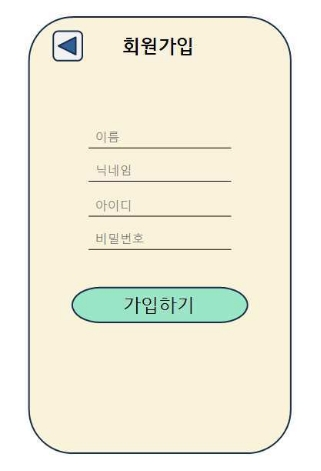
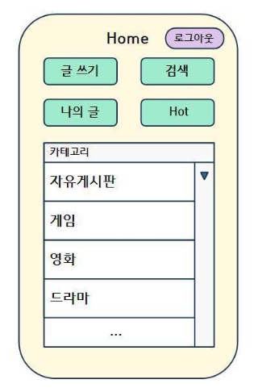
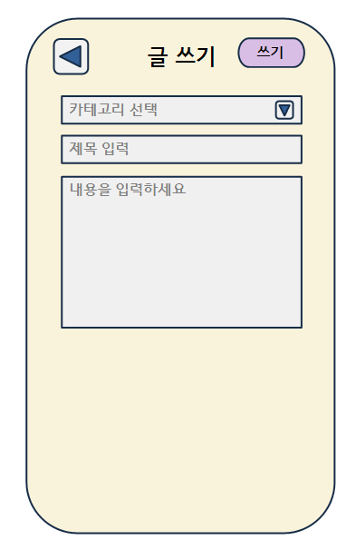
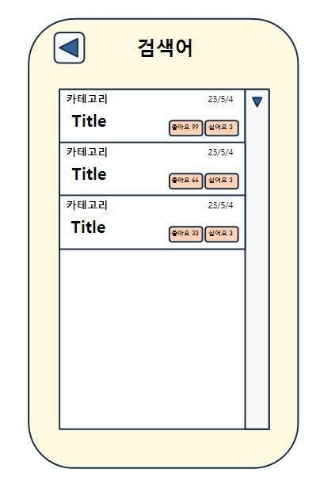
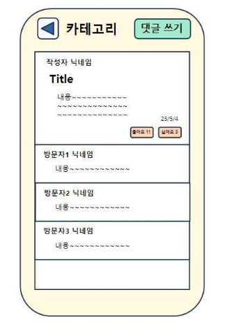
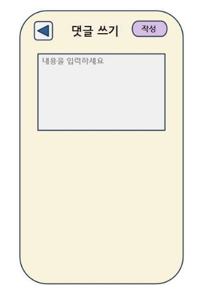

# **Talky 토키**

#### 1\.  Analysis  Document

## [  Revision  history  ]

|**Revision  date**|**Version  #**|**Description**|**Author**|
| - | - | - | - |
|2023/5/4|1\.0|First  Writing||
|2023/5/6|1\.1|Edit User Inteface Prototype 4.Writing Post Screen||
|||||
|||||
|||||
|||||

 

## 1. Introduction
	1) Summary 
  Talky는  개인의  감정과  생각  등  궁금한  점을  사람들과  나누는  것이  중점적인  기능 이다.  이전  문서에서는  Talky  시스템의  요구사항을  명세화했다.  이번  단계에서는  Use case,  Domain,  User  Interface  prototype을  이용해  Talky  시스템이  ‘무엇을’  하는지에 포커스를  맞춰  분석한다.  이들을  통해  사용자의  관점에서  시스템의  기능을  시각적으로 쉽게  알아볼  수  있다.  또한  시스템의  요소의  개략적인  관계를  살피고  인터페이스를  구 체화할  수  있다.  Domain  Analysis를  통해  구현  class들의  내용을  확인  가능하다.  User Interface  prototype은  기능을  확립하는데  도움을  주고.  앱을  구현하는  것을  도와준다.

	2) Describe  the  prominent  features  of  project
Talky는  사용자가  자신의  글을  업로드하고,  이를  본  다른  사용자들은  서로의  생각을 공유하거나  공감한다.  또한  여러명의  사용자가  공감한  게시물을  볼  수  있어,  유익한 지식을  얻거나  유희를  느낄  수  있다.  그리고  검색  기능을  이용해,  사용자가  궁금한  콘 텐츠에  대해  다른  사용자들의  게시물을  찾아볼  수  있다.  사용자는  궁금증을  해결하고 동질감을  형성할  수  있다.  또한  사용자가  이전에  게시했던  글을  찾아보며  추억이나  자 신의  과거를  되돌아볼  수  있다.

 

## 2. Use  case  analysis

	Use  Case  Diagram
	아래  그림은  Talky  시스템의  Use  Case  Diagram을  나타낸  것이다. 

  Use  Case  Diagram은  사용자의  관점에서  시스템의  서비스  혹은  기능  및  그와  관 련한  외부  요소를  알아볼  수  있다.  유스  케이스는  동명사로  작성한다.  include  관계의  화살표  방향  유스  케이스는  필수  선행작업이다.  실선은  상호작용  관계를  나타낸다.

 

## 3. Domain  analysis
	1) User  :  사용자  클래스이다.  로그인  시  아이디  정보가  저장되고,  글  작성시  관련 정보가  저장된다.
	2) DB  :  DataBase  서버의  정보를  담는다.  사용자와  서버가  정보를  주고받을  때  사용된다.
	3) Home  :  홈화면에  저장될  컨텐츠들의  정보를  담는다.
	4) ShowList  :  해당하는  조건에  보여지는  게시물  리스트를  담는다.  리스트의  정렬      조건  등을  설정  가능하다.
	5) Post  :  게시글을  작성하고  나타낼  때  데이터를  저장하고  가져온다.
	6) PostL  :  게시글이  리스트에  나타날  때  미리보기  리스트에  보여지는  데이터들을 관리하는  클래스이다.
	7) Cateroty  :  카테고리마다  글이  등록된  정보를  저장하는  클래스이다.
	8) Comment  :  작성한  댓글에  대한  정보  저장하는  클래스이다.
	9) Reaction  :  좋아요,  싫어요  정보가  저장된다.  Hot을  좌우하는  우선순위를  담는     클래스이다.
	10) DataTime  :  글이  작성된  날짜,  시간이  담길  클래스이다.

 

## 4. User  Interface  prototype
	1. Login  Screen

  
  Talky  앱을 실행하면  다음과  같은  로그인  화면이  보인다.  ‘회원가입‘  버튼을  누르 면  회원가입  화면으로  넘어간다.  로그인  정보들을  입력하고  ’로그인  버튼을  누르면 로그인한다.

 

	2. Join  Screen

이름,  닉네임,  ID,  Password를  모두  입력하고  ’가입하기‘  버튼을  누르면  회원가입 완료한다.  ’뒤로가기’ 버튼을  누르면  로그인  화면으로  돌아간다.

 

	3. Home Screen

로그아웃,  글쓰기,  검색,  나의  글,  Hot,  카테고리  버튼을  누르면  해당하는  화면으 로  넘어간다.

 

	4. Writing Post Screen

  
  로그아웃,  글쓰기,  검색,  나의  글,  Hot,  카테고리  버튼을  누르면  해당하는  화면으 로  넘어간다.

 

	5. Post  List  Screen
		5.1. My  Posts Screen

  
  홈  화면의  ‘나의  글’ 버튼을  클릭하면  보여지는  화면이다.  사용자가  쓴  모든  글 을  리스트로  확인할  수  있다.  리스트는  스크롤  형태이다.

 

		5.2. Hot  Posts Screen

  
  홈  화면의  ‘Hot’  버튼을  클릭하면  보여지는  화면이다.  인기있는  게시글을  리스 트로  확인할  수  있다.  리스트는  스크롤  형태이다.

 

		5.3. Category Posts Screen

  
  카테고리  화면에서  하나의  카테고리를  선택하면  보여지는  화면이다.  카테고리 에  해당하는  모든  게시글을  리스트로  확인할  수  있다.  리스트는  스크롤  형태이 다.

 

		5.4. Search Result Screen

검색  화면에서  ‘찾기’ 버튼을  누르면  나타나는  화면이다.  검색  결과에  해당하는 모든  게시글을  리스트로  확인할  수  있다.  리스트는  스크롤  형태이다.

 

	6. Search Screen

  
  홈  화면의  ‘검색’  버튼을  클릭하면  보여지는  화면이다.  찾고싶은  글을  찾을  수  있다.  글상자  안에  검색어를  입력하고  ‘확인’  버튼을  누르면  검색결과  화면으로  넘어 간다.

 

	7. Post Screen

  
  게시물  리스트에서  클릭한  게시글을  보여주는  화면이다.  글의  여러  가지  정보를 볼  수  있다. 

 

	8. Comment Screen

  
  게시글  화면에서  ‘댓글  쓰기’  버튼을  누르면  나타나는  화면이다.  작성하고  싶은 댓글을  적을  수  있다.  글  상자  안에  댓글을  입력하고  ‘확인’  버튼을  누르면  다시  게 시글  화면으로  넘어간다.  댓글이  추가된  것을  확인할  수  있다.

 

## 5. Glossary

|**Term**|**Description**|
| - | - |
|**Talky**|Talky 시스템. 즉 APP|
|**DB**|Talky와 연결된 데이터베이스|
|**리스트**|여러 컨텐츠가 테이블 형태로 나타난다|
|**게시글**|사용자가 글쓰기를 통해 작성한 글|
|**Prototype**|제품을 구현하는 과정에서 시험용으로 미리 만든 제작물|

 

## 6. References

- Use  case  Diagram  Tool  https://staruml.io/
