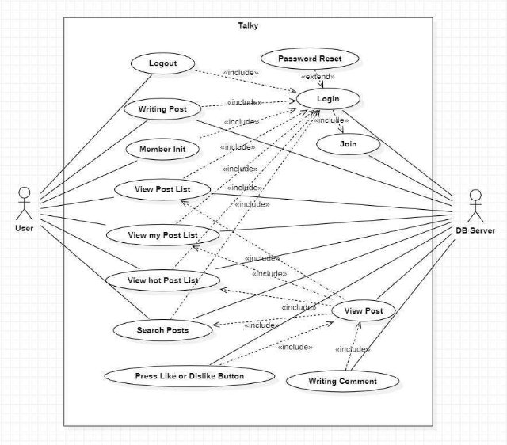

# **Talky 토키**

## 1\.  Analysis  Document

|Student  No.|22112072|
| - | - |
|Name|박예원|
|E-mail|keroro0101@naver.com|

 

### [  Revision  history  ]

|**Revision  date**|**Version  #**|**Description**|**Author**|
| - | - | - | - |
|2023/5/4|1\.0|First  Writing||
|2023/5/6|1\.1|Add  protorype  Writing Posts||
|||||

### =  Contents  =

1. Introduction  .......................................................................................  
2. Use  case  analysis  ..............................................................................  
3. Domain  analysis  ...............................................................................  
4. User  Interface  prototype  ................................................................  
5. Glossary  ...........................................................................................  
6. References  .......................................................................................  

### 7. Introduction
1) Summary 

Talky는  개인의  감정과  생각  등  궁금한  점을  사람들과  나누는  것이  중점적인  기능 이다.  이전  문서에서는  Talky  시스템의  요구사항을  명세화했다.  이번  단계에서는  Use case,  Domain,  User  Interface  prototype을  이용해  Talky  시스템이  ‘무엇을’  하는지에 포커스를  맞춰  분석한다.  이들을  통해  사용자의  관점에서  시스템의  기능을  시각적으로 쉽게  알아볼  수  있다.  또한  시스템의  요소의  개략적인  관계를  살피고  인터페이스를  구 체화할  수  있다.  Domain  Analysis를  통해  구현  class들의  내용을  확인  가능하다.  User Interface  prototype은  기능을  확립하는데  도움을  주고.  앱을  구현하는  것을  도와준다.

2) Describe  the  prominent  features  of  project

Talky는  사용자가  자신의  글을  업로드하고,  이를  본  다른  사용자들은  서로의  생각을 공유하거나  공감한다.  또한  여러명의  사용자가  공감한  게시물을  볼  수  있어,  유익한 지식을  얻거나  유희를  느낄  수  있다.  그리고  검색  기능을  이용해,  사용자가  궁금한  콘 텐츠에  대해  다른  사용자들의  게시물을  찾아볼  수  있다.  사용자는  궁금증을  해결하고 동질감을  형성할  수  있다.  또한  사용자가  이전에  게시했던  글을  찾아보며  추억이나  자 신의  과거를  되돌아볼  수  있다.

### 2. Use  case  analysis

#### 2.1  Use  Case  Diagram

아래  그림은  Talky  시스템의  Use  Case  Diagram을  나타낸  것이다. 

Use  Case  Diagram은  사용자의  관점에서  시스템의  서비스  혹은  기능  및  그와  관 련한  외부  요소를  알아볼  수  있다.  유스  케이스는  동명사로  작성한다.  include  관계의  화살표  방향  유스  케이스는  필수  선행작업이다.  실선은  상호작용  관계를  나타낸다.

#### 2\.1  Use  Case  Description

|**Use Case #1 : Login**||
| - | :- |
|**GENERAL  CHARACTERISTICS**||
|**Summary**|Talky 앱을 사용하기 위해 사용자 등록을 확인한다.|
|**Scope**|Talky|
|**Level**|User level|
|**Author**|Park Ye Won|
|**Last Update**|2023\.05.04|
|**Status**|Analysis|
|**Primary  Actor**|Customer, DB|
|**Preconditions**|Talky에 회원등록이 되어있어야 한다.|
|**Trigger**|앱을 시작하면 바로 로그인 화면이 실행된다|
|**Success  Post Condition**|회원  인증에  성공하면  Talky의  모든  기능을  사용할  수 있다.|
|**Failed Post Condition**|회원인증에 실패하면 Talky의 기능을 사용할 수 없다|
|**MAIN  SUCCESS SCENARIO**||
|**Step**|Action|
|**S**|회원이 Talky에 로그인한다|
|**1**|Talky 앱을 실행하면 로그인 화면이 실행된다.|
|**2**|회원 정보를 입력하고 ‘로그인‘ 버튼을 누른다|
|**3**|홈  화면으로  전환되며  Talky의  모든  기능을  이용할  수 있다. Use case는 종료된다|
|**EXTENSION  SCENARIOS**||
|**Step**|Branching Action|
|**2**|
2a. 모든 정보를 입력하지 않고 버튼을 누른 경우

`   `2a1. 모든 정보를 입력하라는 토스트창을 띄운다. 2b. 아이디, 패스워드가 일치하지 않는 경우

`   `2b1. 아이디,패스워드가 틀렸다는 토스트창을 띄운다
|
|**RELATED  INFORMATION**||
|**Performance**|<= 2 seconds|
|**Frequency**|Variable|
|**<Concurrency>**|제한 없음|
|**Due Date**||

|**Use Case #2 : Join**||
| - | :- |
|**GENERAL  CHARACTERISTICS**||
|**Summary**|Talky 앱을 사용하기 위해 신규 사용자를 등록한다|
|**Scope**|Talky|
|**Level**|User level|
|**Author**|Park Ye Won|
|**Last Update**|2023\.05.04|
|**Status**|Analysis|
|**Primary  Actor**|Customer, DB|
|**Preconditions**|Talky 앱을 실행한다|
|**Trigger**|로그인 화면에서 회원가입 버튼을 눌렀을 때|
|**Success  Post Condition**|사용자 등록이 완료되며, 앱의 모든 기능을 사용할 수 있 다|
|**Failed Post Condition**|사용자 등록이 되어있지 않으면 앱을 사용할 수 없다|
|**MAIN  SUCCESS SCENARIO**||
|**Step**|Action|
|**S**|Talky에 신규 사용자를 등록한다|
|**1**|로그인 화면의 ‘회원가입‘ 버튼을 누르면 사용자 정보 입 력 화면으로 전환된다|
|**2**|아이디(Email), 패스워드 등 사용자 정보를 입력한다|
|**3**|아이디 중복검사와 이메일 양식 검사 하고 ‘회원가입‘ 버 튼을 누른다|
|**4**|로그인 화면으로 전환되며 Use case가 종료된다|
|**EXTENSION  SCENARIOS**||
|**Step**|Branching Action|
|**2**|
2a. 정보 입력 화면에서 로그인‘ 버튼을 누르른 경우

`   `2a1.  현재  입력  정보를  저장하지  않고  다시  로그인 화면으로 돌아간다
|
|**3**|
3a. 모든 정보가 입력되지 않았는데 버튼을 누른 경우    3a1. 모든 정보를 입력하라는 토스트창을 띄운다 3b. 아이디 중복검사를 하지 않고 버튼을 누른 경우

`   `3b1. 중복 되었다는 토스트창을 띄운다
|
|**RELATED  INFORMATION**||
|**Performance**|<= 2 seconds|
|**Frequency**|Variable|
|**<Concurrency>**|제한 없음|
|**Due Date**||

|**Use Case #3 : Logout**||
| - | :- |
|**GENERAL  CHARACTERISTICS**||
|**Summary**|Talky에 로그인된 계정을 로그아웃한다|
|**Scope**|Talky|
|**Level**|User level|
|**Author**|Park Ye Won|
|**Last Update**|2023\.05.04|
|**Status**|Analysis|
|**Primary  Actor**|Customer|
|**Preconditions**|Talky에 로그인 되어있어야 한다|
|**Trigger**|홈화면에서 ‘로그아웃’ 버튼을 눌렀을 때|
|**Success  Post Condition**|첫  화면으로  돌아가고  Talky의  모든  기능을  사용할  수 없다|
|**Failed Post Condition**||
|**MAIN  SUCCESS SCENARIO**||
|**Step**|Action|
|**S**|회원이 Talky에서 로그아웃 한다|
|**1**|홈화면에서 ‘로그아웃’ 버튼을 누른다|
|**2**|계정이 로그아웃되고 Use case를 종료하며 로그인 화면 으로 돌아간다|
|**EXTENSION  SCENARIOS**||
|**Step**|Branching Action|
|**1**|
1a. “정말 로그아웃 하시겠습니까?“ 라는 팝업창을 띄운 다

`   `1a1. ‘확인’ 버튼을 누르면 종료된다

`   `1a2. ‘취소‘ 버튼을 누르면 로그아웃이 되지않고 다시 홈화면으로 돌아간다
|
|**RELATED  INFORMATION**||
|**Performance**|<= 2 seconds|
|**Frequency**|Variable|
|**<Concurrency>**|제한 없음|
|**Due Date**||
|**Use Case #4 : Password  Reset**||
|**GENERAL  CHARACTERISTICS**||
|**Summary**|Talky에 등록된 계정의 비밀번호를 변경한다|
|**Scope**|Talky|
|**Level**|User level|
|**Author**|Park Ye Won|
|**Last Update**|2023\.05.04|
|**Status**|Analysis|
|**Primary  Actor**|Customer, DB|
|**Preconditions**|Talky에 로그아웃 되어있어야 한다|
|**Trigger**|로그인 화면에서 ‘비밀번호 변경’ 버튼 눌렀을 때|
|**Success  Post Condition**|이메일으로 비밀번호 변경 메일이 전송된다.|
|**Failed Post Condition**|이메일 잘못입력|
|**MAIN  SUCCESS SCENARIO**||
|**Step**|Action|
|**S**|Talky에 등록된 사용자의 비밀번호를 변경한다.|
|**1**|로그인  화면의  비밀번호  변경‘  버튼을  누르면  비밀번호 변경 화면으로 전환된다|
|**2**|아이디(Email)를 입력한다|
|**3**|계정에 존재하는 이메일이 맞을 경우, 이메일로 비밀번호 변경 메일이 전송된다|
|**4**|다시 원래있던 화면으로 전환된다|
|**EXTENSION  SCENARIOS**||
|**Step**|Branching Action|
|**3**|
3a. 이메일 입력이 잘못된 경우

`   `3a1. 이메일이 입력이 잘못되었다는 토스트창을 띄운 다.
|
|**RELATED  INFORMATION**||
|**Performance**|<= 2 seconds|
|**Frequency**|Variable|
|**<Concurrency>**|제한 없음|
|**Due Date**||
|**Use Case #5 : Member  Init**||
|**GENERAL  CHARACTERISTICS**||
|**Summary**|Talky 앱 사용자의 회원정보를 등록한다.|
|**Scope**|Talky|
|**Level**|User level|
|**Author**|Park Ye Won|
|**Last Update**|2023\.05.04|
|**Status**|Analysis|
|**Primary  Actor**|Customer, DB|
|**Preconditions**|Talky 앱 로그인을 한다|
|**Trigger**|로그인 화면에서 로그인이 성공했을 때 회원정보가 미리 등록되지 않은 경우, 홈 화면에서 ‘회원정보’ 버튼을 눌렀 을 때|
|**Success  Post Condition**|회원정보 등록이 완료된다|
|**Failed Post Condition**|회원정보를 다 입력하지 않은 경우|
|**MAIN  SUCCESS SCENARIO**||
|**Step**|Action|
|**S**|Talky 사용자의 회원정보를 등록한다|
|**1**|로그인을 성공하거나, 홈 화면에서 ‘회원정보’ 버튼을 누 른다|
|**2**|닉네임, 전화번호, 생년월일, 주소를 입력한다|
|**3**|닉네임 중복검사와 양식 검사를 한다|
|**4**|홈 화면으로 전환되고 Use Case가 종료된다|
|**EXTENSION  SCENARIOS**||
|**Step**|Branching Action|
|**3**|
3a. 회원정보가 모두 적히지 않은 경우

`   `3a1. 닉네임이 중복되면 등록에 실패한다

`   `3a2. 닉네임, 전화번호, 생년월일, 주소 등이 입력되지 않은 경우 게시글 등록에 실패한다. 전화번호는 10자리, 생년월일은 6자리 이상 입력해야한다
|
|**RELATED  INFORMATION**||
|**Performance**|<= 2 seconds|
|**Frequency**|Variable|
|**<Concurrency>**|제한 없음|
|**Due Date**||
|**Use Case #6 : Writing  Post**||
|**GENERAL  CHARACTERISTICS**||
|**Summary**|Talky에 올리고 싶은 게시물을 작성한다|
|**Scope**|Talky|
|**Level**|User level|
|**Author**|Park Ye Won|
|**Last Update**|2023\.05.04|
|**Status**|Analysis|
|**Primary  Actor**|Customer, DB|
|**Preconditions**|Talky에 로그인 되어있어야 한다|
|**Trigger**|홈화면에서 ‘글쓰기’ 버튼을 눌렀을 때|
|**Success  Post Condition**|글이 등록된다|
|**Failed Post Condition**|글 내용을 모두 입력하지 않으면 실패한다|
|**MAIN  SUCCESS SCENARIO**||
|**Step**|Action|
|**S**|원하는 글을 작성하여 Talky 시스템에 글을 등록한다.|
|**1**|홈화면에서 ‘글쓰기’ 버튼을 선택한다|
|**2**|글쓰기 화면으로 전환한다.|
|**3**|글에 대한 정보들을 입력하고 ‘쓰기’ 버튼을 누른다|
|**4**|카메라 버튼을 누르면 사진을 찍어 올릴 수 있다|
|**5**|글이 DB에 저장되고 Use case가 종료된다.|
|**EXTENSION  SCENARIOS**||
|**Step**|Branching Action|
|**3**|
3a. 글의 내용이 모두 적히지 않은 경우

`   `3a1. 제목, 내용 등이 입력되지 모두 않은 경우 게시 글 등록에 실패한다.
|
|**RELATED  INFORMATION**||
|**Performance**|<= 2 seconds|
|**Frequency**|Variable|
|**<Concurrency>**|제한 없음|
|**Due Date**||
|**Use Case #7 : Search Posts**||
|**GENERAL  CHARACTERISTICS**||
|**Summary**|원하는 내용의 게시글을 검색한다|
|**Scope**|Talky|
|**Level**|User level|
|**Author**|Park Ye Won|
|**Last Update**|2023\.05.04|
|**Status**|Analysis|
|**Primary  Actor**|Customer, DB|
|**Preconditions**|Talky에 로그인 되어있어야 한다.|
|**Trigger**|홈화면에서 ‘글 쓰기’ 버튼을 눌렀을 때|
|**Success  Post Condition**|이후 궁금한 게시글 리스트를 볼 수 있다|
|**Failed Post Condition**|검색어가 DB에 저장된 글들의 내용과 일치하는 부분이 없는 경우, 아무런 글이 보이지 않는다|
|**MAIN  SUCCESS SCENARIO**||
|**Step**|Action|
|**S**|원하는 검색어로 게시글을 검색한다|
|**1**|홈화면에서 ‘검색’ 버튼을 누르면 검색 화면으로 전환된 다|
|**2**|검색어를 입력하고 ‘완료’ 버튼을 누른다|
|**3**|검색어와 일치하는 내용의 게시글 리스트를 보여준다|
|**4**|게시글을 선택하면 Use case는 끝이난다|
|**EXTENSION  SCENARIOS**||
|**Step**|Branching Action|
|**2**|
2a. 검색어를 글의 제목, 내용이 아닌 다른 단어를 설정 해서 일치하는 글이 없는 경우

`   `2a1. 이를 방지하기 위해 검색어를 입력받을 때 제목 혹은 내용을 입력하라고 알린다

2b. 검색어를 입력하지 않고 ‘완료‘ 버튼을 누른 경우

`   `2b1. 검색하지 않는다
|
|**3**|
3a. ‘뒤로가기’ 버튼을 누르는 경우

`   `3a1. 다시 검색 화면으로 돌아간다
|
|**RELATED  INFORMATION**||
|**Performance**|<= 3 seconds|
|**Frequency**|Variable|
|**<Concurrency>**|제한 없음|
|**Due Date**||
|**Use Case #8 : View Post List**||
|**GENERAL  CHARACTERISTICS**||
|**Summary**|Talky의 모든 게시글 리스트를 보여준다|
|**Scope**|Talky|
|**Level**|User level|
|**Author**|Park Ye Won|
|**Last Update**|2023\.05.04|
|**Status**|Analysis|
|**Primary  Actor**|Customer, DB|
|**Preconditions**|로그인 되어있어야 한다|
|**Trigger**|홈화면을 실행할 때|
|**Success  Post Condition**|등록된 모든 글이 리스트 형태로 보여진다. 리스트는 스 크롤 가능하다. 이후 글을 자세히 볼 수 있다|
|**Failed Post Condition**|아무런 글이 보이지 않는다|
|**MAIN  SUCCESS SCENARIO**||
|**Step**|Action|
|**S**|등록된 모든 게시물을 리스트로 확인한다 |
|**1**|홈화면을 실행하면 보여준다|
|**2**|사용자들이 작성한 모든 글을 볼 수 있다.|
|**3**|게시글을 선택하면 Use case는 끝이난다|
|**EXTENSION  SCENARIOS**||
|**Step**|Branching Action|
|**2**|2a. DB에서 글을 불러오지 못한 경우    2a1. 글이 보여지지 않는다|
|**/RELATED  INFORMATION**||
|**Performance**|<= 2 seconds|
|**Frequency**|Variable|
|**<Concurrency>**|제한 없음|
|**Due Date**||
|**Use Case #9 : View Post**||
|**GENERAL  CHARACTERISTICS**||
|**Summary**|게시글의 내용을 자세히 보여준다|
|**Scope**|Talky|
|**Level**|User level|
|**Author**|Park Ye Won|
|**Last Update**|2023\.05.04|
|**Status**|Analysis|
|**Primary  Actor**|Customer, DB|
|**Preconditions**|게시글 리스트를 보고 있어야 한다|
|**Trigger**|리스트에서 글을 선택했을 때|
|**Success  Post Condition**|이후 게시글에 댓글이나, 반응을 남길 수 있다|
|**Failed Post Condition**|DB와 연결이 끊기는 경우 글 내용이 보이지 않는다|
|**MAIN  SUCCESS SCENARIO**||
|**Step**|Action|
|**S**|게시글 내용을 자세히 보여준다|
|**1**|리스트에서 하나의 글을 선택한 경우 시작된다|
|**2**|글을 자세히 볼 수 있다|
|**3**|이후에 댓글이나, 리액션을 남길 수 있다|
|**4**|뒤로가기 버튼을 누르면 use case는 종료된다|
|**EXTENSION  SCENARIOS**||
|**Step**|Branching Action|
|**2**|
2a. DB에서 잘못된 글을 가져온 경우

`   `2a1. 검색 알고리즘을 다시 설계한다
|
|**RELATED  INFORMATION**||
|**Performance**|<= 2 seconds|
|**Frequency**|Variable|
|**<Concurrency>**|제한 없음|
|**Due Date**||
|**Use Case #10 : View My Post List**||
|**GENERAL  CHARACTERISTICS**||
|**Summary**|사용자가 이전에 작성했던 모든 게시글을 본다|
|**Scope**|Talky|
|**Level**|User level|
|**Author**|Park Ye Won|
|**Last Update**|2023\.05.04|
|**Status**|Analysis|
|**Primary  Actor**|Customer, DB|
|**Preconditions**|Talky에 로그인 되어있어야 한다.|
|**Trigger**|홈화면에서 ‘나의 글’ 라디오 버튼을 선택했을 때|
|**Success  Post Condition**|사용자가 작성한 모든 글이 리스트 형태로 보여진다. 리스트는 스크롤 가능하다. 이후 글을 자세히 볼 수 있 다.|
|**Failed Post Condition**|아무런 글이 보이지 않는다|
|**MAIN  SUCCESS SCENARIO**||
|**Step**|Action|
|**S**|자신이  이전에  작성한  모든  게시물을  리스트로  확인한 다 |
|**1**|홈화면에서 ‘나의글’ 라디오 버튼을 누르면 시작된다.|
|**2**|사용자가 작성했던 모든 글을 볼 수 있다.|
|**3**|게시글을 선택하면 Use case는 끝이난다|
|**EXTENSION  SCENARIOS**||
|**Step**|Branching Action|
|**3**|
3a. 글 하나를 선택한다

`   `3a1. 글을 자세히 볼 수 있는 화면으로 전환된다
|
|**RELATED  INFORMATION**||
|**Performance**|<= 2 seconds|
|**Frequency**|Variable|
|**<Concurrency>**|제한 없음|
|**Due Date**||
|**Use Case #11 : View Hot Post List**||
|**GENERAL  CHARACTERISTICS**||
|**Summary**|모든 사용자가 작성한 게시글들 중에 인기있는 글을 리 스트로 보여준다|
|**Scope**|Talky|
|**Level**|User level|
|**Author**|Park Ye Won|
|**Last Update**|2023\.05.04|
|**Status**|Analysis|
|**Primary  Actor**|Customer, DB|
|**Preconditions**|Talky에 로그인 되어있어야 한다|
|**Trigger**|홈화면에서 ‘hot’ 라디오 버튼을 선택했을 때|
|**Success  Post Condition**|hot한  글이  리스트  형태로  보여진다.  리스트는  스크롤 가능하다. 이후 글을 자세히 볼 수 있다|
|**Failed Post Condition**|아무런 글이 보이지 않는다|
|**MAIN  SUCCESS SCENARIO**||
|**Step**|Action|
|**S**|인기있는 게시물을 리스트로 확인한다 |
|**1**|홈화면에서 ‘Hot’ 라디오 버튼을 누르면 시작된다.|
|**2**|사용자가 작성했던 모든 글을 볼 수 있다.|
|**3**|게시글을 선택하면 Use case는 끝이난다|
|**EXTENSION  SCENARIOS**||
|**Step**|Branching Action|
|**2**|
3a. 글 하나를 선택한다

`   `3a1. 글을 자세히 볼 수 있는 화면으로 전환된다
|
|**RELATED  INFORMATION**||
|**Performance**|<= 2 seconds|
|**Frequency**|Variable|
|**<Concurrency>**|제한 없음|
|**Due Date**||
|**Use Case #12 : Writing  Comment**||
|**GENERAL  CHARACTERISTICS**||
|**Summary**|게시글에 대해 댓글을 남긴다|
|**Scope**|Talky|
|**Level**|User level|
|**Author**|Park Ye Won|
|**Last Update**|2023\.05.04|
|**Status**|Analysis|
|**Primary  Actor**|Customer, DB|
|**Preconditions**|게시글을 보고 있어야 한다|
|**Trigger**|글 보기 화면에서 ‘댓글쓰기’ 버튼을 눌렀을 때|
|**Success  Post Condition**|이후 작성한 댓글을 글 보기 화면에서 볼 수 있다|
|**Failed Post Condition**|댓글 작성을 실패한다|
|**MAIN  SUCCESS SCENARIO**||
|**Step**|Action|
|**S**|게시글에 대한 댓글을 작성한다|
|**1**|글 보기 화면에서 ‘댓글쓰기’ 버튼을 누른다|
|**2**|작성하고 싶은 내용을 입력하고 ‘완료’ 버튼을 누른다|
|**3**|Use case가 종료된다|
|**EXTENSION  SCENARIOS**||
|**Step**|Branching Action|
|**2**|
2a. 내용을 입력하지 않고 ‘완료’ 버튼을 누른 경우

`   `2a1. 댓글 쓰기를 완료하지 않는다

2b. 뒤로가기 버튼을 누른 경우

`   `2b1. 댓글쓰기가 중단되고 다시 글 보기 화면으로 돌 아간다
|
|**RELATED  INFORMATION**||
|**Performance**|<= 2 seconds|
|**Frequency**|Variable|
|**<Concurrency>**|제한 없음|
|**Due Date**||
|**Use Case #13 : Press  Like/Dislike  Button**||
|**GENERAL  CHARACTERISTICS**||
|**Summary**|게시글에 대해 좋아요 혹은 싫어요 반응을 남긴다|
|**Scope**|Talky|
|**Level**|User level|
|**Author**|Park Ye Won|
|**Last Update**|2023\.05.04|
|**Status**|Analysis|
|**Primary  Actor**|Customer, DB|
|**Preconditions**|게시글을 보고 있어야 한다|
|**Trigger**|글  보기  화면에서  좋아요  혹은  싫어요  버튼을  눌렀을 때|
|**Success  Post Condition**|누른 반응의 점수가 올라간다|
|**Failed Post Condition**|x|
|**MAIN  SUCCESS SCENARIO**||
|**Step**|Action|
|**S**|사용자가 게시글에 대해 반응을 남긴다|
|**1**|글 보기 화면에서 ‘좋아요‘ 혹은 ’싫어요’ 버튼을 누른다|
|**2**|누른 반응의 점수가 1 증가한다|
|**3**|Use case가 종료된다|
|**EXTENSION  SCENARIOS**||
|**Step**|Branching Action|
||x|
|**RELATED  INFORMATION**||
|**Performance**|<= 2 seconds|
|**Frequency**|Variable|
|**<Concurrency>**|제한 없음|
|**Due Date**||

### 3. Domain  analysis
1) User  :  사용자  클래스이다.  로그인  시  아이디  정보가  저장되고,  글  작성시  관련 정보가  저장된다.
2) DB  :  DataBase  서버의  정보를  담는다.  사용자와  서버가  정보를  주고받을  때  사용된다.
3) Home  :  홈화면에  저장될  컨텐츠들의  정보를  담는다.
4) ShowList  :  해당하는  조건에  보여지는  게시물  리스트를  담는다.  리스트의  정렬  조건  등을  설정  가능하다.
5) Post  :  게시글을  작성하고  나타낼  때  데이터를  저장하고  가져온다.
6) PostL  :  게시글이  리스트에  나타날  때  미리보기  리스트에  보여지는  데이터들을 관리하는  클래스이다.
7) Cateroty  :  카테고리마다  글이  등록된  정보를  저장하는  클래스이다.
8) Comment  :  작성한  댓글에  대한  정보  저장하는  클래스이다.
9) Reaction  :  좋아요,  싫어요  정보가  저장된다.  Hot을  좌우하는  우선순위를  담는     클래스이다.
10) DataTime  :  글이  작성된  날짜,  시간이  담길  클래스이다.  

### 4. User  Interface  prototype

#### 1. Login  Screen

Talky  앱을  실행하면  다음과  같은  로그인  화면이  보인다.  ‘회원가입‘  버튼을  누르 면  회원가입  화면으로  넘어간다.  로그인  정보들을  입력하고  ’로그인  버튼을  누르면 로그인한다.‘

#### 2. Join  Screen

ID(이메일),  Password를  모두  입력하고  ’회원가입‘  버튼을  누르면  회원가입  완료 한다.  ’로그인’ 버튼을  누르면  로그인  화면으로  돌아간다.

#### 3. Password  Reset  Screen

로그인  화면에서  ‘비밀번호  변경’ 버튼을  누르면  실행된다.

#### 4. Home  Screen

로그아웃,  회원정보,  글쓰기,  검색,  나의  글,  Hot  버튼을  누르면  해당하는  화면으 로  넘어간다.

#### 5. Member  Init  Screen

로그인 화면에서 로그인이 성공했을 때 회원정보가 미리 등록되지 않은 경우, 홈 화면 에서 ‘회원정보’ 버튼을 눌렀을 때

#### 6. Writing  Post  Screen

홈화면에서  ‘글쓰기’ 버튼을  누르면  나타나는  화면이다.  정보들을  입력하고  ‘쓰기’ 버튼을  누르면  글이  작성된다.

#### 7. Camera  Screen

글  쓰기  화면에서  ‘카메라  그림’ 버튼을  클릭하면  보여지는  화면이다.  사용자가 카메라로  사진을  찍을  수  있다. 

#### 8. Search  Screen

홈  화면의  ‘검색’  버튼을  클릭하면  보여지는  화면이다.  찾고싶은  글을  찾을  수  있 다.  글상자  안에  검색어를  입력하고  ‘확인’  버튼을  누르면  검색결과  화면으로  넘어 간다.

#### 9. View Post  

게시물  리스트에서  클릭한  게시글을  보여주는  화면이다.  글의  여러  가지  정보를 볼  수  있다. 

### 5. Glossary

|**Term**|**Description**|
| - | - |
|**Talky**|Talky 시스템. 즉 APP|
|**DB**|Talky와 연결된 데이터베이스|
|**리스트**|여러 컨텐츠가 테이블 형태로 나타난다|
|**게시글**|사용자가 글쓰기를 통해 작성한 글|
|**Prototype**|제품을 구현하는 과정에서 시험용으로 미리 만든 제작물|

### 6. References

\- Use  case  Diagram  Tool  <https://staruml.io/>
