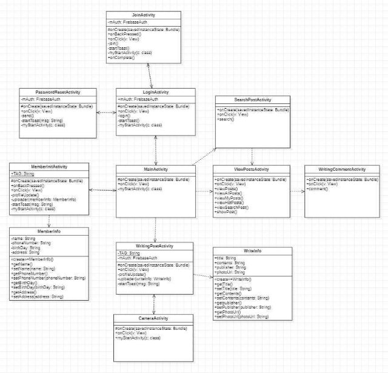
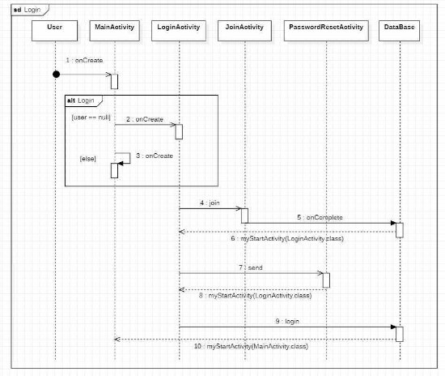
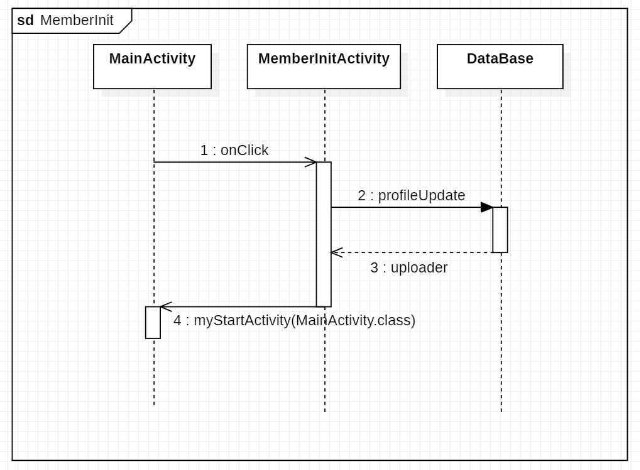
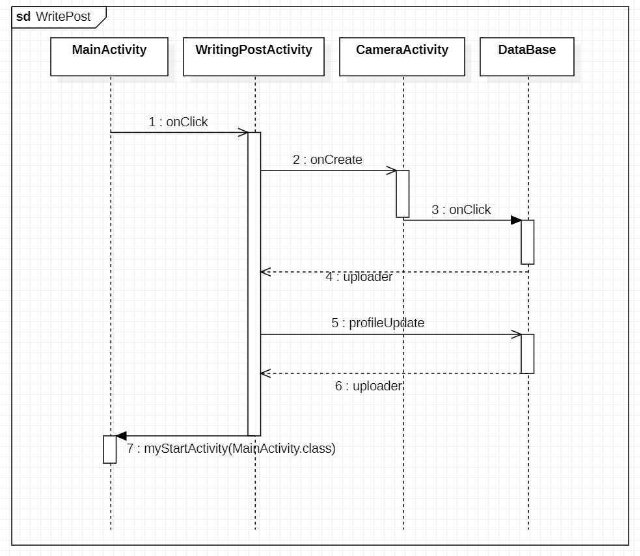
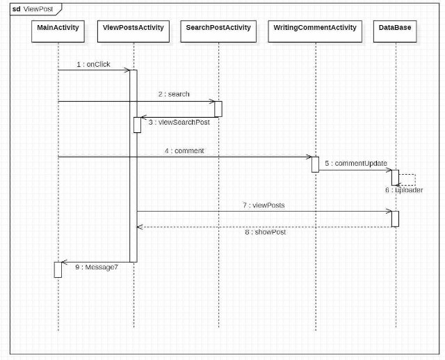
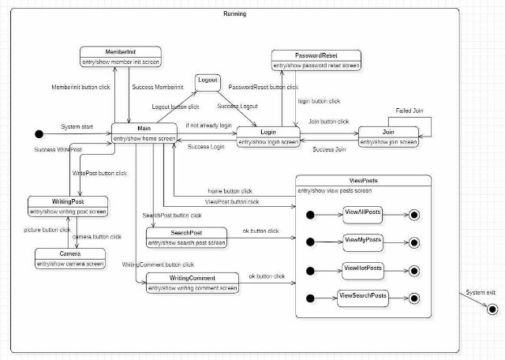

# **Talky  토키**

## 1\. Design Document

|Student  No.|22112072|
| - | - |
|Name|박예원|
|E-mail|keroro0101@naver.com|

### [ Revision history ]

|**Revision  date**|**Version  #**|**Description**|**Author**|
| - | - | - | - |
||#1|First  design  phase||
||#1.1|Change  Fonts||
|||||  

### = Contents =

1. Introduction ..........................................................................................
2. Class diagram ........................................................................................
3. Sequence diagram ..................................................................................
4. State machine diagram ............................................................................ 
5. Implementation requirements ...................................................................
6. Glossary ....................................................................................................
7. References .................................................................................................

### 1. **Introduction**

Talky는 사용자가 자신의 글을 업로드하고, 이를 본 다른 사용자들은 서로의 생각을 공유하거나 공감한다. 또한 여러명의 사용자가 공감한 게시물을 볼 수 있어, 유익한 지 식을 얻거나 유희를 느낄 수 있다. 그리고 검색 기능을 이용해, 사용자가 궁금한 콘텐 츠에 대해 다른 사용자들의 게시물을 찾아볼 수 있다. 이를 통해 사용자는 궁금증을 해결하고 동질감을 형성하는 것이 Talky의 목적이다.

본  문서는  Analysis  단계  이후의  Design  단계의  문서로  class  diagram,  sequence diagram, state machine diagram을 그리고 각 diagram에 대한 코멘트를 한다. 추가로 implementation requirements를 기술해 Talky을 구현하기 위힌 소프트웨어 및 하드웨 어  요구사항을  기술한다.  Talky  시스템은  안드로이드  운영체제  기반의  스마트폰에서 개발될 것으로, ios 운영체제에서는 사용할 수 없다.

### 2. **Class diagram**

다음은 talky 시스템의 클래스 다이어그램이다. 클래스 다이어그램에 대한 상세 설명 은 다음 페이지에 기술되어 있다.

1) LoginActivity

|Attributes|
| - |
|-mAuth: FirebaseAuth : 파이어베이스 객체|
|Methods|
|
#onCreate(in savedInstanceState:Bundle) : 액티비티가 생성될 때 처음 호출 +onClick(in v:View) : 버튼이 클릭되었을 때 실행

+login() : 로그인 실행

-startToast() : 로그인 로직 후 토스트 알림

-myStartActivity(in c:class) : 액티비티 전환
|

2) JoinActivity

|Attributes|
| - |
|-mAuth: FirebaseAuth : 파이어베이스 객체|
|Methods|
|
#onCreate(in savedInstanceState:Bundle) : 액티비티가 생성될 때 처음 호출 +onBackPressed() : 뒤로가기 했을 때 앱 종료

+onClick(in v:View) : 버튼이 클릭되었을 때 실행

-join() : 회원가입 실행

+onComplete() : 회원가입 성공

-startToast() : 로그인 로직 후 토스트 알림

-myStartActivity(in c:class) : 액티비티 전환
|

3) PasswordResetActivity

|Attributes|
| - |
|-mAuth: FirebaseAuth : 파이어베이스 객체|
|Methods|
|
#onCreate(in savedInstanceState:Bundle) : 액티비티가 생성될 때 처음 호출 +onClick(in v:View) : 버튼이 클릭되었을 때 실행

+send() : 이메일으로 패스워드 변경 메시지 전송

-startToast() : 로그인 로직 후 토스트 알림

-myStartActivity(in c:class) : 액티비티 전환
|

4) MainActivity

|Attributes|
| - |
||
|Methods|
|
#onCreate(in savedInstanceState:Bundle) : 액티비티가 생성될 때 처음 호출 +onClick(in v:View) : 버튼이 클릭되었을 때 실행

-myStartActivity(in c:class) : 액티비티 전환
|

1) MemberInitActivity

|Attributes|
| - |
|+TAG: String : 액티비티 이름|
|Methods|
|
#onCreate(in savedInstanceState:Bundle) : 액티비티가 생성될 때 처음 호출 +onBackPressed() : 뒤로가기 했을 때 앱 종료

+onClick(in v:View) : 버튼이 클릭되었을 때 실행

-profileUpdate() : 회원정보를 데이터베이스에 업로드하는 함수 -uploader(memberInfo:MemberInfo) : 회원 정보를 데이터베이스에 업로드 -startToast() : 로그인 로직 후 토스트 알림

-myStartActivity(in c:class) : 액티비티 전환
|

6) MemberInfo

|Attributes|
| - |
|name: String : 회원 이름 phoneNumber: String : 회원 전화번호 birthDay: String : 회원 생년월일 address: String : 회원 주소|
|Methods|
|
<<create>>MemberInfo() : 생성자

getName() : 이름 변수 얻기

setName(in name:String) : 이름 변수 설정

getPhoneNumber() : 전화번호 변수 얻기

setPhoneNumber(in phoneNumber:String) : 전화번호 변수 설정 getBirthDay() : 전화번호 변수 얻기

setBirthDay(in birthDay:String) : 생년월일 변수 설정 getAddress() : 주소 변수 얻기

setAddress(in address:String) : 주소 변수 설정
|

7) WritingPostActivity

|Attributes|
| - |
|
+TAG: String : 액티비티 이름

-mAuth: FirebaseAuth : 파이어베이스 객체
|
|Methods|
|
#onCreate(in savedInstanceState:Bundle) : 액티비티가 생성될 때 처음 호출 +onClick(in v:View) : 버튼이 클릭되었을 때 실행

-profileUpdate() : 글 정보를 저장

-uploader(writeInfo:WriteInfo) : 글 정보를 데이터베이스에 업로드 -startToast(msg:String) : 로그인 로직 후 토스트 알림
|

8) WriteInfo

|Attributes|
| - |
|
title: String : 글 제목

contents: String : 글 내용

publisher: String : 글 작성자 photoUrl: String : 글 첨부 이미지 url
|
|Methods|
|
<<create>>WriteInfo() : 생성자

getTitle() : 제목 변수 얻기

setTitle(in name:String) : 제목 변수 설정

getContents() : 내용 변수 얻기

setContents(in phoneNumber:String) : 전화번호 변수 설정 getPublisher() : 작성자 변수 얻기

setPublisher(in birthDay:String) : 생년월일 변수 설정 getPhotoUrl() : 첨부 이미지 url 변수 얻기

setPhotoUrl(in address:String) : 주소 변수 설정
|

9) CameraActivity

|Attributes|
| - |
||
|Methods|
|
#onCreate(in savedInstanceState:Bundle) : 액티비티가 생성될 때 처음 호출 +onClick(in v:View) : 버튼이 클릭되었을 때 실행

-myStartActivity(in c:class) : 액티비티 전환
|

10) ViewPostsActivity

|Attributes|
| - |
||
|Methods|
|
#onCreate(in savedInstanceState:Bundle) : 액티비티가 생성될 때 처음 호출 +onClick(in v:View) : 버튼이 클릭되었을 때 실행

+viewPosts() : 조건에 따라 보고 싶은 게시물 보기

+viewAllPosts() : 모든 게시물 보기

+viewMyPosts() : 내가 쓴 게시물 보기

+viewHotPosts() : Hot한 게시물 보기

+showPost() : 게시물 자세히 보기
|

11)  WritingCommentActivity

|Attributes|
| - |
||
|Methods|
|
#onCreate(in savedInstanceState:Bundle) : 액티비티가 생성될 때 처음 호출 +onClick(in v:View) : 버튼이 클릭되었을 때 실행

+comment() : 댓글 작성
|

12) SearchPostActivity

|Attributes|
| - |
||
|Methods|
|
#onCreate(in savedInstanceState:Bundle) : 액티비티가 생성될 때 처음 호출 +onClick(in v:View) : 버튼이 클릭되었을 때 실행

+search() : 글 검색
|

### 3. **Sequence  diagram**

데이터베이스로  firebase의  firestore을  채택한다.  여기서  user는  회원가입  하여 firebase에 사용자 등록한 계정주이다.

시스템이 시작되면 메인 액티비티가 실행된다. 이전에 로그인이 되어있다면, 그대로 메인 액티비티가 계속된다. 만약 로그인이 안 되어있다면, 로그인 액티비티를 실행한 다. 로그인 액티비티에서 회원가입 버튼을 누르면 회원가입 액티비티가 실행된다. 회원 가입 화면에서 이메일,  비밀번호를 입력하고 회원가입 버튼을 누르면 회원가입  성공 시 데이터베이스에 저장된다. 로그인 액티비티에서 비밀번호 변경 버튼을 누르면 비밀 번호 변경 액티비티가 실행된다. 이메일을 입력하고 확인 버튼을 누르면 입력한 이메 일로 비밀번호 변경 메일이 전달된다. 이 메일을 통해 비밀번호 변경이 가능하다. 로그 인 액티비티에서 로그인 정보를 입력하고 로그인 버튼을 누르면 데이터베이스에서 확 인 후 로그인 성공/실패가 전환된다. 이들은 실행 후에 로그인 또는 메인 액티비티로 전환된다.

메인 액티비티에서 회원정보 버튼을 클릭하면 회원정보 등록 액티비티로 전환된다. 회원정보를 입력하고 확인 버튼을 누르면 profileUpdate() 함수를 통해 데이터베이스에 저장된다. 저장이 완료되면 myStartActivity() 함수를 통해 메인 액티비티가 실행돼 홈 화면이 실행된다.

메인 액티비티에서 글쓰기 버튼을 누르면 글쓰기 액티비티가 실행된다. 카메라 버튼 을 누르면 카메라 액티비티가 실행되고 사진찍기 버튼을 누르면 사진이 찍힌다. 찍힌 사진은 데이터베이스의 storage에 저장된다. 그리고 다시 글 쓰기 액티비티로 전환된 다. 글 정보를 마저 입력하고 쓰기 버튼을 누르면 글이 firestore에 저장된다. 저장에 성공하면 다시 메인 액티비티가 실행된다.

메인 액티비티에서 게시물 보기 액티비티를 실행한다. 보기 버튼을 누르면 데이터베 이스에서 글 정보를 받아와 showPost를 통해 게시물이 자세히 보여진다. 검색 버튼을 누르면 search를 통해 원하는 글을 검색한다. 댓글 쓰기 버튼을 누르면 comment를 통 해 댓글을 작성하고 작성된 댓글이 데이터베이스에 업로드된다.

### 4. **State machine  diagram**

다음은  talky  시스템의  state  machine  diagram  이다.  state  들은  대부분  Activity로 구성되어 있다. 시스템 화면이 talky 앱의 상태를 이룬다고 생각했기 때문이다. 따라서 talky  앱을  시작했을  때  어떤  Activity가  실행되는지와,  source  Activity에서  target Activity로의 전환 관계에 중점을 둔 다이어그램이다.

### 5. **Implementation  requirements**

우선 Android Studio의 Virtual device로 테스트했다.

- Android Studio virtual device (Pixel 3a API 33)

안드로이드에서 구동 가능하며 최소 SDK 버전은 24 이다.

### 6. **Glossary**

|**Term**|**Description**|
| - | - |
|**Talky**|Talky 시스템. 즉 APP|
|**DB**|Talky와 연결된 데이터베이스|
|**리스트**|여러 컨텐츠가 테이블 형태로 나타난다|
|**게시글**|사용자가 글쓰기를 통해 작성한 글|
|**Prototype**|제품을 구현하는 과정에서 시험용으로 미리 만든 제작물|
|**Activity**|애플리케이션의 컴포넌트(Componenet) 즉, 화면|

### 7. **References**

- Firebase 문서 [https://firebase.google.com/docs?hl=ko&authuser=0&_gl=1*1uhrqul*_ga*MTY4NjAyM Dk5LjE2ODM3NDE2MTU.*_ga_CW55HF8NVT*MTY4NjMyMTc0Ny4xOS4xLjE2ODYzMjE3 NTQuMC4wLjA](https://firebase.google.com/docs?hl=ko&authuser=0&_gl=1*1uhrqul*_ga*MTY4NjAyMDk5LjE2ODM3NDE2MTU.*_ga_CW55HF8NVT*MTY4NjMyMTc0Ny4xOS4xLjE2ODYzMjE3NTQuMC4wLjA).
